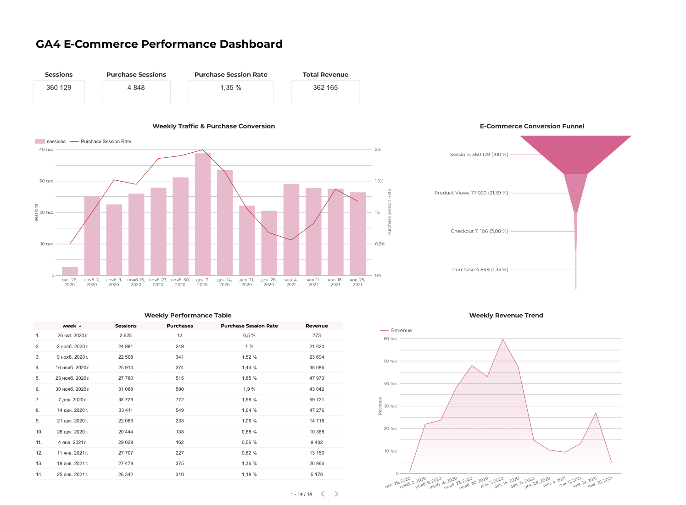

# GA4 E-Commerce Analytics

An end-to-end e-commerce analytics project using Google Analytics 4 data, BigQuery, SQL, and Looker Studio.

## Project Overview

The goal of this project was to analyze e-commerce website performance and user behavior using the Google Analytics 4 public e-commerce dataset.

The analysis focuses on traffic, purchase conversion, revenue trends, and the customer journey from session to purchase.

## Tools

- Google BigQuery
- SQL
- Google Analytics 4 (GA4)
- Looker Studio

## Key Metrics

- **360,129** Sessions
- **4,848** Purchase Sessions
- **1.35%** Purchase Session Rate
- **362,165** Total Revenue

## Analysis

The project includes:

- Weekly traffic and conversion analysis
- E-commerce conversion funnel
- Purchase behavior analysis
- Revenue trend analysis
- KPI monitoring
- Data quality validation

## Conversion Funnel

The session-based funnel was analyzed across four stages:

| Funnel Stage | Sessions | % of Total Sessions |
|---|---:|---:|
| Sessions | 360,129 | 100% |
| Product Views | 77,020 | 21.39% |
| Checkout | 11,106 | 3.08% |
| Purchase | 4,848 | 1.35% |

## Key Insights

- Purchase activity and traffic increased substantially during the November–December period.
- The highest weekly traffic occurred in early December, accompanied by a relatively high purchase conversion rate.
- Only **21.39%** of sessions reached a product-view stage.
- **3.08%** of sessions reached checkout and **1.35%** resulted in a purchase.
- Revenue followed a strong seasonal pattern, peaking during the high-traffic December period.

These patterns are consistent with increased e-commerce activity during the holiday shopping period, although the dataset alone does not establish the underlying cause.

## Dashboard

A Looker Studio dashboard was created to visualize:

- Sessions
- Purchase Sessions
- Purchase Session Rate
- Total Revenue
- Weekly traffic and conversion trends
- Conversion funnel
- Weekly revenue trends
- Weekly performance metrics



## Data Source

Google Analytics 4 public obfuscated sample e-commerce dataset available in Google BigQuery.

## Repository Structure

```text
ga4-ecommerce-analytics/
├── README.md
├── sql/
│   ├── weekly_kpis.sql
│   └── conversion_funnel.sql
└── images/
    └── dashboard.png
